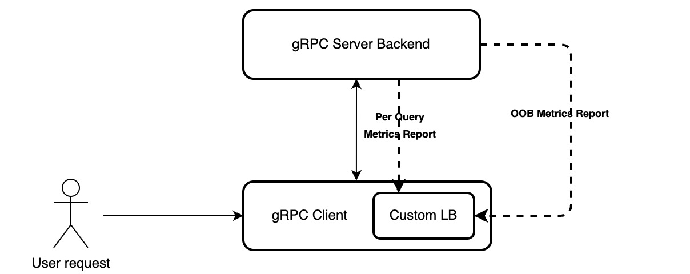

# gRPC

## Terms

1. **IDL(Interface Definition Language)**

2. What's stream in protobuf.
   1. Unary RPC
   2. Server Streaming RPC
   3. Client Streaming RPC
   4. Bidirectional Streaming RPC (Live Chat Application )

```protobuf
rpc BidiHello(stream HelloRequest) returns (stream HelloResponse);

# In summary, the main difference between unary calls and streaming calls in gRPC is the number and direction of messages exchanged between the client and server. Unary calls involve a single request and a single response, while streaming calls enable continuous streams of messages between the client and server.
```

3. Stub = client

## [Authentication](https://grpc.io/docs/guides/auth/)


## Compression


## Custom Backend Metrics



